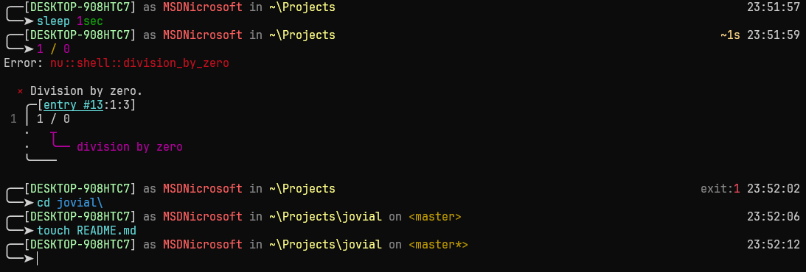

# Jovial Nushell Theme

A shell theme [Jovial](https://github.com/zthxxx/jovial) implemented in [Nushell](https://www.nushell.sh/)



## Installation

- Download file [jovial.nu](./jovial.nu)
- Move the file into your `nu` config directory
- Apped the follow code in `$env.config.hooks.pre_execution` of your configuration file (`config.nu`)
    ```nushell
    { load-env { _jovial_pre_time: (date now | into string) } }
    ```

    For example:
    ```nushell
    $env.config = {
    # ...
        hooks: {
            # ...
            pre_execution: [
                # ...
                { load-env { _jovial_pre_time: (date now | into string) } }
            ]
        }
    }
    ```
- Append the follow code in your configuration file (`config.nu`)
```nushell
# Note: Use absolute path
use C:\Users\YOURUSERNAME\AppData\Roaming\nushell\jovial.nu

$env.PROMPT_COMMAND = { jovial prompt-command }
$env.PROMPT_COMMAND_RIGHT = { jovial prompt-command-right }
$env.PROMPT_INDICATOR = { jovial prompt-indicator }
$env.PROMPT_MULTILINE_INDICATOR = { jovial multiline-indicator }
```